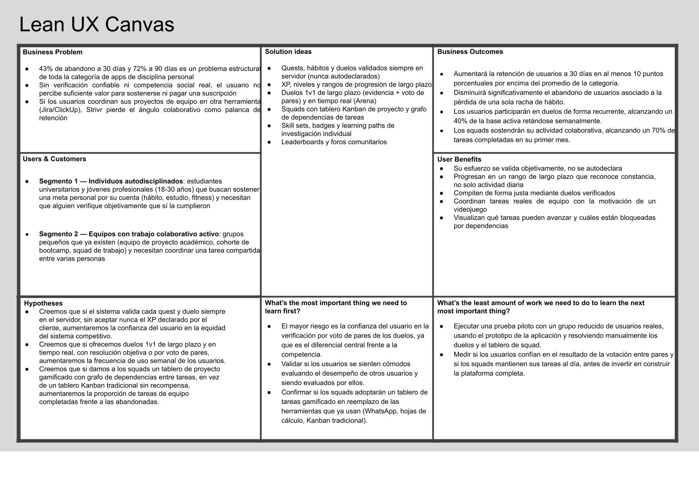

### 1.2.2. Lean UX Process

Nuestro servicio ofrece una plataforma web de gamificación de la disciplina personal (Strivr), que convierte metas individuales y grupales en misiones (quests) medibles con progresión de experiencia (XP), niveles y rangos, verificadas siempre en el servidor. Hemos observado que los usuarios que intentan sostener un hábito o una meta por su cuenta abandonan sistemáticamente antes de consolidarlo, y que las herramientas actuales no ofrecen ni verificación confiable del progreso ni una competencia social real que sostenga la motivación en el tiempo. ¿De qué manera podríamos convertir el seguimiento de metas personales y de equipo en una experiencia gamificada, verificada y competitiva que sostenga la motivación de los usuarios más allá de la caída natural de las primeras semanas?

#### 1.2.2.1. Lean UX Problem Statements

Nuestro servicio ofrece una plataforma web de gamificación de la disciplina personal orientada a convertir metas individuales y grupales —hábitos, estudio, entrenamiento físico, desarrollo de habilidades técnicas— en quests medibles con progresión de experiencia (XP), niveles y rangos de largo plazo, dirigida inicialmente a estudiantes universitarios y jóvenes profesionales que intentan sostener hábitos de autodisciplina, así como a equipos pequeños (grupos de estudio, squads de proyecto) que buscan reforzar la constancia colectiva mediante competencia social y coordinación gamificada del trabajo en equipo.

Hemos observado que, al intentar sostener una meta por cuenta propia, los usuarios enfrentan un abandono sistemático: una revisión sistemática de 18 estudios con más de 500,000 participantes encontró que una mediana del 70% de los usuarios discontinúa el uso de este tipo de apps dentro de los primeros 100 días (Kidman et al., 2024). Esta deserción se agrava porque las herramientas tradicionales dependen del honor del propio usuario para marcar algo como completado, sin verificación externa, y no ofrecen refuerzo social competitivo más allá de una racha individual que se rompe de forma silenciosa y sin consecuencia visible para nadie más. Por otro lado, cuando estas mismas personas necesitan coordinar una meta en equipo (un proyecto académico, un reto grupal), recurren a herramientas completamente distintas y no gamificadas (hojas de cálculo, tableros Kanban genéricos, chats de WhatsApp), duplicando el esfuerzo de seguimiento. Esta situación evidencia una brecha entre el estado actual —seguimiento solitario, autodeclarado, sin verificación, y desconectado del trabajo en equipo— y un estado ideal en el que el progreso individual y grupal se valida de forma confiable, se comparte con una comunidad que genera presión social positiva, y se sostiene mediante mecánicas de juego diseñadas específicamente para el largo plazo, con una retención de día 30 muy por encima del 5% promedio de la industria (Forasoft, 2026).

¿De qué manera podríamos convertir el seguimiento de metas personales y grupales en una experiencia gamificada, verificada en servidor y socialmente competitiva, que sostenga la motivación de los usuarios más allá de la caída natural de las primeras semanas, y que además permita a equipos pequeños coordinar y gamificar su propio trabajo colaborativo?

#### 1.2.2.2. Lean UX Assumptions

##### Preguntas sobre el Producto / Usuario (User Assumptions)

###### ¿Quién es el usuario?
Nuestros usuarios se dividen en dos segmentos, diferenciados no por edad u ocupación sino por el trabajo que llegan a resolver. El Segmento 1 son individuos autodisciplinados —estudiantes universitarios y jóvenes profesionales (18-30 años)— que buscan sostener una meta personal por su cuenta (hábito, estudio, fitness) y disfrutan de mecánicas de videojuego. El Segmento 2 son equipos con trabajo colaborativo activo —un grupo de proyecto académico, una cohorte de bootcamp, un squad ya existente— que necesitan coordinar tareas compartidas y llegan buscando reemplazar una herramienta no gamificada (WhatsApp, hojas de cálculo, Kanban tradicional). Una misma persona puede pertenecer a ambos segmentos en momentos distintos, según qué trabajo esté resolviendo en ese momento. De forma indirecta, impactamos también a los moderadores de comunidad que sostienen los foros temáticos.

- El usuario individual usará el sistema para asumir quests, registrar hábitos, retar a otros en duelos y progresar en su nivel y rango.
- El líder de squad lo usará para crear proyectos, repartir tareas en el tablero y revisar el grafo de dependencias del equipo.
- El moderador lo usará para resolver reportes de contenido en los foros.

###### ¿Dónde encaja nuestro producto en su trabajo o vida?
Reemplazará el uso disperso de apps de hábitos individuales, recordatorios nativos del teléfono, hojas de cálculo o tableros físicos para metas grupales, y chats de WhatsApp o Discord para coordinar retos entre amigos o compañeros de equipo. Se usará a diario, en momentos cortos (revisar el catálogo de quests en la mañana, marcar completitud en la noche) y en sesiones más largas durante los duelos en tiempo real de la Arena.

###### ¿Qué problemas tiene nuestro producto que resolver?
La deserción temprana por falta de validación externa del progreso y de competencia social estructurada. Específicamente:

- El abandono de hábitos por ausencia de verificación real (el usuario se autoengaña o pierde el interés al no rendir cuentas a nadie).
- La fragmentación entre "quiero mejorar solo" y "quiero coordinar con mi equipo", que hoy se resuelven con herramientas completamente distintas.
- La falta de reconocimiento de largo plazo: un nivel diario no captura meses de constancia de la misma forma que un rango.
- La injusticia percibida al competir sin un mecanismo objetivo de verificación de resultados.

###### ¿Cuándo y cómo es usado nuestro producto?
De forma diaria y recurrente, con picos de uso concentrados en dos momentos:

- Mañana: revisión del catálogo de quests propias y del tablero de proyecto del squad.
- Durante el día: registro de cumplimiento de hábitos y avance en learning paths.
- Momentos competitivos puntuales: duelos en tiempo real (Arena), sesiones cortas y sincrónicas.
- Semanal: revisión de leaderboard, rango del squad y roster de aportes.

###### ¿Qué características son importantes?
- Validación de completitud siempre en el servidor, nunca aceptando el XP declarado por el cliente.
- Duelos 1v1 de largo plazo y en tiempo real, con resolución objetiva o por voto de pares.
- Rangos de progresión de largo plazo, independientes del nivel diario.
- Squads con tablero Kanban y grafo de dependencias para coordinar trabajo real de equipo, no solo hábitos individuales.

###### ¿Cómo debe verse nuestro producto y cómo debe comportarse?
Debe sentirse como un juego competitivo, no como una herramienta de productividad corporativa.

- Estética oscura tipo esports, con feedback inmediato (barras de XP, glow al desbloquear logros).
- El flujo de registrar una acción completada debe tomar el menor número de clics posible.
- El tablero del squad debe comunicar de un vistazo qué tareas están disponibles y cuáles bloqueadas.

---

##### Business Assumptions

Creo que mis clientes necesitan una plataforma que:

- Sostenga su motivación más allá de las primeras semanas
- Verifique de forma confiable que el progreso reportado es real
- Ofrezca competencia social significativa, no solo un contador de racha
- Permita coordinar metas grupales con la misma lógica de juego que las metas individuales

Estas necesidades se pueden resolver con:

> La implementación de Strivr, una plataforma que convierte metas personales y de equipo en quests validadas en servidor, con XP, niveles, rangos, duelos y squads que gamifican tanto la disciplina individual como la colaboración en proyectos.

###### Clientes iniciales
Estudiantes universitarios de carreras exigentes y jóvenes profesionales en Lima Metropolitana que:

- Ya probaron apps de gamificación de hábitos sin resultados sostenidos
- Participan de proyectos académicos o grupales que hoy coordinan con herramientas no gamificadas

###### Propuesta de valor

**Para el usuario individual:**
- Ver su esfuerzo validado objetivamente, no autodeclarado
- Progresar en un sistema de rango de largo plazo que reconoce constancia, no solo actividad diaria
- Competir de forma justa mediante duelos verificados

**Para el squad/equipo:**
- Coordinar tareas reales de un proyecto con la motivación de un videojuego
- Visualizar dependencias de tareas para saber qué se puede avanzar
- Compartir el reconocimiento (XP y rango de squad) del trabajo en equipo

###### Beneficios adicionales

**Para el usuario:**
- El reinicio de una racha no borra el XP ya ganado, reduciendo la sensación de "empezar de cero"
- Reconocimiento visible de sus áreas de desarrollo mediante el radar de habilidades

**Para la comunidad/plataforma:**
- Contenido generado por usuarios (custom quests, publicaciones de foro) que reduce el costo de producir contenido
- Datos de comportamiento agregados que permiten calibrar la dificultad y el XP de las quests

###### Estrategia de adquisición de clientes
- Boca a boca y embajadores dentro de centros de estudiantes universitarios
- Landing page con contenido segmentado por perfil (individual vs. squad/equipo)
- Viralidad orgánica mediante la invitación directa a un duelo

###### Modelo de ingresos
Modelo freemium, a definir en detalle por el equipo:

- Núcleo gratuito: quests, XP, niveles, duelos y squads
- Suscripción premium sugerida por: historial extendido, cosméticos de perfil, o límites ampliados de proyectos por squad

###### Competencia
- Apps de gamificación de hábitos individuales (Habitica)
- Apps de resiliencia y bienestar gamificado (SuperBetter)
- Plataformas de compromiso conductual con staking financiero (StickK)
- Herramientas de gestión de proyectos no gamificadas (Jira, ClickUp, Trello), en el ángulo de Squads

###### Ventaja competitiva
Strivr es, dentro de su categoría competitiva, el único que combina:

- Validación de completitud siempre en servidor, nunca autodeclarada
- Duelos 1v1 y en tiempo real con resolución objetiva o por voto comunitario
- Rangos de progresión de largo plazo, separados del nivel diario
- Squads que gamifican trabajo colaborativo real, no solo hábitos personales

###### Riesgos principales
- Fatiga de gamificación y abandono, dado que toda la categoría sufre alta deserción
- Conflictos dentro de un squad (miembros que no colaboran, tareas abandonadas)
- Percepción de injusticia en la votación de pares de los duelos de largo plazo

###### Mitigación
- Rangos de largo plazo que no dependen de una sola racha para mantener el compromiso
- Reglas de negocio explícitas sobre límites (una tarea activa a la vez, apelación de resultados)
- Visibilidad del historial de votos y apelaciones para sostener la percepción de juego limpio

###### Suposiciones tecnológicas
Se asume que los usuarios cuentan con:

- Conexión a internet estable, necesaria para la validación en servidor y los duelos en tiempo real
- Un dispositivo con navegador web moderno

**Riesgo:**
Los duelos en tiempo real (Arena) dependen de una conexión estable; una desconexión puede resolver el duelo en contra del usuario desconectado.

**Posible solución:**
Un periodo de gracia de reconexión con reincorporación al estado vigente del duelo dentro de un plazo definido.

#### 1.2.2.3. Lean UX Hypothesis Statements

#### Hipótesis y Métricas

##### Hipótesis 1
**Hipótesis:**
Creemos que si el sistema valida cada quest y duelo siempre en el servidor —sin aceptar nunca el XP declarado por el cliente— aumentaremos la confianza del usuario en la equidad del sistema competitivo, reduciendo el abandono temprano típico de la categoría.

**Métrica:**
Sabremos que funcionó cuando la retención a 30 días de los primeros usuarios alcance al menos el 15%, frente al 5% promedio de la industria (Fora Soft, 2026).

---

##### Hipótesis 2
**Hipótesis:**
Creemos que si ofrecemos duelos 1v1 de largo plazo y en tiempo real, con resolución objetiva o por voto de pares, en vez de solo una racha individual, aumentaremos la frecuencia de uso semanal de los usuarios.

**Métrica:**
Sabremos que esto funcionó cuando el porcentaje de usuarios activos que participan en al menos un duelo por semana alcance el **40%** de la base activa dentro de los primeros dos meses.

---

##### Hipótesis 3
**Hipótesis:**
Creemos que si introducimos un sistema de rangos de progresión de largo plazo, independiente del nivel diario, reduciremos el abandono asociado a la pérdida de una sola racha.

**Métrica:**
Sabremos que funcionó cuando la retención a 100 días supere el 30% promedio de la industria (70% de abandono a 100 días, Kidman et al., 2024), alcanzando al menos un 40%.

---

##### Hipótesis 4
**Hipótesis:**
Creemos que si damos a los squads un tablero de proyecto gamificado con grafo de dependencias —en vez de un tablero Kanban tradicional sin recompensa— aumentaremos la proporción de tareas de equipo completadas frente a las abandonadas.

**Métrica:**
Sabremos que funcionó cuando la tasa de completitud de tareas de squad supere el **70%** dentro de las primeras cuatro semanas de vida de cada squad.

#### 1.2.2.4. Lean UX Canvas

## 1.3. Segmentos objetivo

### Segmento 1: Individuos autodisciplinados (estudiantes universitarios y jóvenes profesionales)

El segmento primario de Strivr está compuesto por estudiantes universitarios y jóvenes profesionales de entre 18 y 29 años, de nivel socioeconómico B y C, concentrados principalmente en Lima Metropolitana y otras ciudades con alta concentración de instituciones de educación superior.

En cuanto al tamaño del mercado, Sunedu registra 1.2 millones de estudiantes matriculados en universidades licenciadas a nivel nacional, de los cuales aproximadamente 578,000 corresponden a Lima Metropolitana, repartidos entre 35 universidades licenciadas en la capital de un total de 97 a nivel nacional (La República, 2025). A esto se suma la población de jóvenes profesionales recién egresados, en un contexto donde el 12.52% de la población peruana ya cuenta con educación superior universitaria completa (Senaju, 2024).

Este segmento se caracteriza por una conectividad prácticamente universal: el 95.8% de los peruanos de 19 a 24 años accedió a internet en el tercer trimestre de 2025, cifra que se sostiene en 94.2% para el grupo de 25 a 40 años, y el 99.2% de quienes cuentan con educación superior universitaria usa teléfono celular, frente a solo 81.8% entre quienes completaron únicamente educación primaria (Infobae, 2026). Es, por tanto, un segmento nativo digital sin barreras de acceso tecnológico. Sin embargo, es también el segmento más propenso al abandono temprano de herramientas de autodisciplina: una revisión sistemática de 18 estudios con más de 500,000 participantes encontró que una mediana del 70% de los usuarios discontinúa el uso de apps de hábitos y bienestar dentro de los primeros 100 días (Kidman et al., 2024), lo que evidencia la necesidad de mecánicas de retención más fuertes que las que ofrecen las herramientas actuales.

### Segmento 2: Equipos con trabajo colaborativo activo (grupos de proyecto y squads)

El segmento secundario está conformado por equipos pequeños, de entre 3 y 8 integrantes, que ya coordinan un trabajo compartido antes de considerar una herramienta como Strivr: grupos de proyecto de cursos universitarios con entregables grupales obligatorios (como los que exigen las carreras de Ingeniería de Software y afines), cohortes de bootcamps de programación, y squads de trabajo en etapas tempranas. Comparten el mismo rango etario y nivel socioeconómico del Segmento 1 —de hecho, se extraen de la misma base de aproximadamente 578,000 estudiantes universitarios de Lima Metropolitana (La República, 2025)—, ya que gran parte de las carreras de ingeniería en el Perú incorporan formalmente el trabajo en equipo bajo metodologías ágiles (sprints, tableros Kanban, entregas por hitos) como parte de su malla curricular.

A diferencia del Segmento 1, su necesidad no nace de sostener un hábito personal sino de coordinar una tarea que ya involucra a otras personas. Actualmente resuelven esta coordinación con herramientas genéricas y no gamificadas —WhatsApp para la comunicación, hojas de cálculo para el seguimiento de tareas, o tableros Kanban sin ningún sistema de recompensa—, lo que limita tanto la trazabilidad del aporte individual como la motivación sostenida del equipo a lo largo de un proyecto de varias semanas.