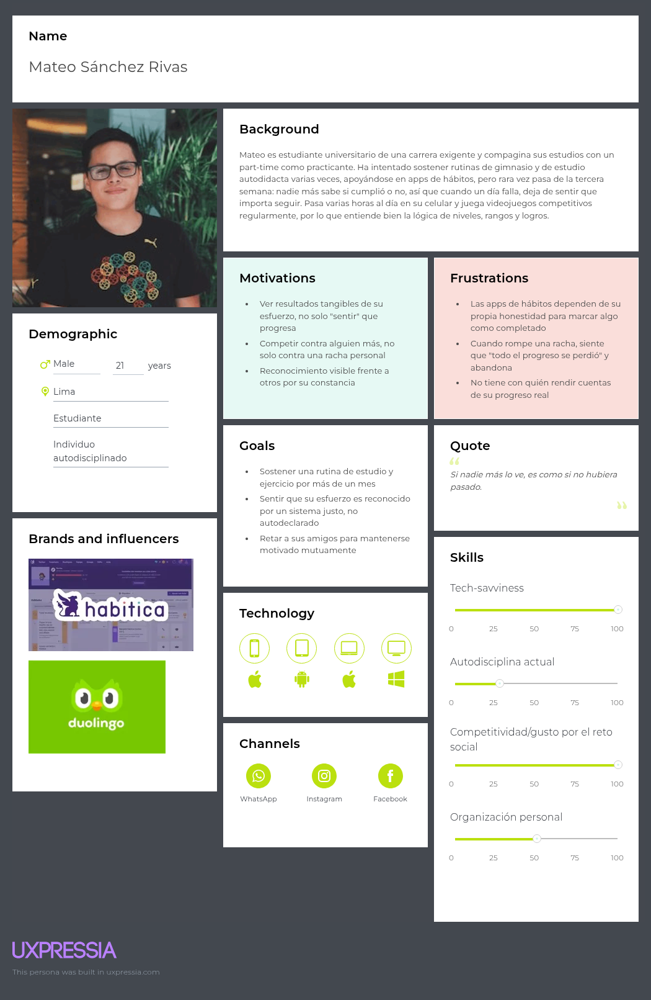
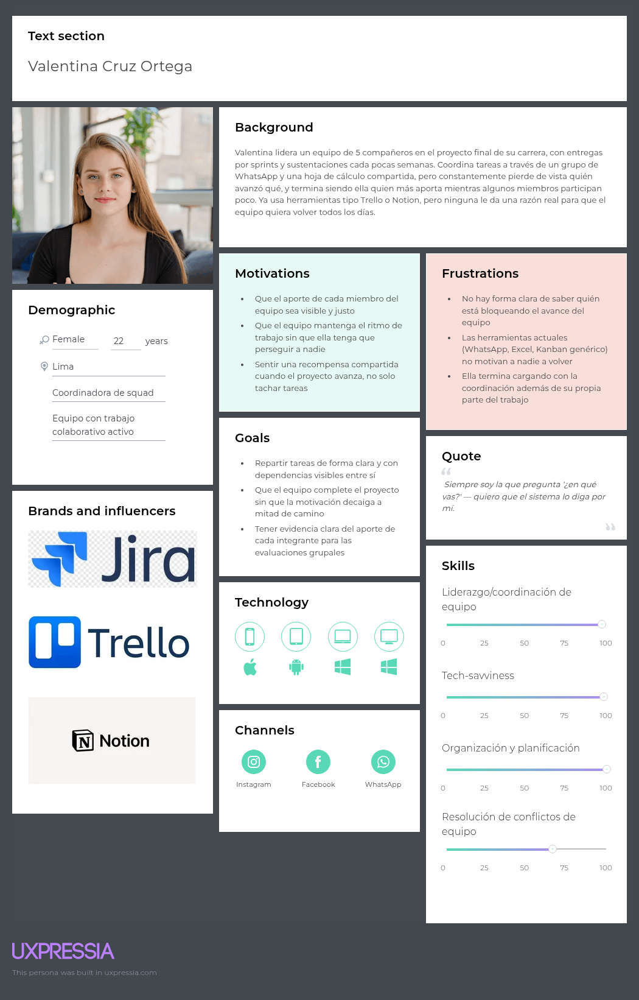

# Capítulo II: Requirements Elicitation & Analysis

## 2.2. Entrevistas

### 2.2.1. Diseño de entrevistas

Esta sección presenta la guía de entrevista elaborada para cada uno de los dos segmentos objetivo definidos en la sección 1.3: el Segmento 1, compuesto por individuos autodisciplinados —estudiantes universitarios y jóvenes profesionales de 18 a 30 años que sostienen metas personales por cuenta propia—, y el Segmento 2, compuesto por integrantes de equipos con trabajo colaborativo activo —grupos de proyecto académico, cohortes de bootcamp y squads de trabajo de 3 a 8 personas—. Cada guía reúne un conjunto de preguntas principales, que se formulan a todos los entrevistados del segmento, y preguntas complementarias, que el entrevistador utiliza únicamente como repregunta cuando la respuesta a la pregunta principal no cubre el dato requerido.

Ambas guías se diseñaron para recolectar la información que exige la construcción de los User Personas de la sección 2.3.1: características demográficas (género, edad, distrito de residencia, estado civil, familia y ocupación) y características subjetivas y tecnológicas (personalidad, habilidades, marcas e influencias, dispositivos de preferencia, canales digitales de interacción, objetivos, frustraciones y biografía o background). La correspondencia entre cada campo del arquetipo y las preguntas que lo alimentan se detalla en la matriz de cobertura al final de la sección.

#### Buenas prácticas aplicadas al diseño

El diseño de ambas guías siguió los siguientes criterios:

- **Preguntas abiertas.** Ninguna pregunta principal admite una respuesta de «sí» o «no»; todas solicitan una descripción, un relato o una explicación por parte del entrevistado.
- **Preguntas no inducidas.** No se menciona a Strivr, sus mecánicas ni las hipótesis del equipo en ningún momento de la entrevista, y ninguna pregunta sugiere la respuesta esperada ni califica de antemano la experiencia del entrevistado. En particular, se evita preguntar «¿qué tan frustrante te resulta…?» y se pregunta en su lugar «¿cómo describirías esa experiencia?».
- **Un solo tema por enunciado.** Cada pregunta aborda un único aspecto; los temas que en el habla cotidiana se encadenan —por ejemplo, dispositivos y canales digitales— se separan en preguntas distintas.
- **Orden de lo general a lo específico.** La secuencia avanza desde el contexto de vida del entrevistado hacia sus prácticas concretas y sus frustraciones, de modo que las preguntas iniciales no condicionen la interpretación de las posteriores.
- **Comportamiento observado antes que intención declarada.** Las preguntas del dominio piden relatos de hechos concretos y recientes («cuéntame la última vez que…») en lugar de proyecciones hipotéticas, cuya respuesta suele reflejar lo que el entrevistado cree que debería hacer y no lo que efectivamente hace.
- **Neutralidad léxica.** Se evita el vocabulario del producto (quest, XP, nivel, rango, duelo, squad) y cualquier adjetivo valorativo dentro del enunciado de la pregunta.

#### Consideraciones de aplicación

- **Modalidad y duración.** Entrevista semiestructurada, presencial o por videollamada, con una duración estimada de 30 a 40 minutos.
- **Registro.** La entrevista se graba en video previa autorización verbal del entrevistado, registrada en la propia grabación, conforme a lo indicado en la sección 2.2.2.
- **Ficha de registro.** Los datos factuales del entrevistado (nombres y apellidos, edad, distrito de residencia y ocupación) se consignan en la ficha de registro de la entrevista. Las preguntas del Bloque 1 recogen esos mismos datos de forma conversacional, de modo que el entrevistado los aporte junto con su contexto y no como un formulario.
- **Uso de las preguntas complementarias.** Son contingentes: se formulan solo si la respuesta a la pregunta principal deja sin cubrir el dato buscado. El entrevistador no las lee en bloque.
- **Cierre sin presentación del producto.** La entrevista de esta etapa es exploratoria y no valida ninguna solución; la presentación del prototipo y la recolección de reacciones corresponden a las entrevistas de validación de la sección 5.3.

---

#### 2.2.1.1. Guía de entrevista — Segmento 1: Individuos autodisciplinados

**Perfil del entrevistado:** persona de 18 a 30 años, estudiante universitario o profesional joven, residente en Lima Metropolitana, que en los últimos seis meses haya intentado sostener por cuenta propia una meta personal recurrente —un hábito, una rutina de estudio, un entrenamiento físico o el aprendizaje de una habilidad técnica—, con independencia de si lo logró o lo abandonó.

**Objetivo de la guía:** comprender cómo esta persona define, sigue y abandona sus metas personales, con qué herramientas y dispositivos lo hace, qué la motiva a sostenerlas y qué papel juegan otras personas en ello.

##### Bloque 0 — Apertura y consentimiento (2 minutos)

Presentación del entrevistador y del equipo, explicación del propósito académico de la entrevista, aclaración de que no existen respuestas correctas ni incorrectas, y solicitud de autorización para grabar en video.

##### Bloque 1 — Perfil demográfico y contexto personal (5 minutos)

**S1-P01.** Para empezar, cuéntame un poco sobre ti: ¿cómo describirías tu situación actual?

- *S1-P01.1.* ¿A qué te dedicas actualmente y cómo es una semana típica para ti?
- *S1-P01.2.* ¿Qué edad tienes?
- *S1-P01.3.* ¿Con qué género te identificas?

**S1-P02.** Descríbeme el lugar donde vives y cómo es tu convivencia ahí.

- *S1-P02.1.* ¿En qué distrito vives?
- *S1-P02.2.* ¿Con quiénes compartes ese espacio?
- *S1-P02.3.* ¿Cómo describirías tu situación familiar o de pareja hoy?

**S1-P03.** Cuéntame cómo se reparte tu tiempo entre tus responsabilidades y lo que haces por gusto.

- *S1-P03.1.* ¿Qué obligaciones ocupan la mayor parte de tu semana?
- *S1-P03.2.* ¿Qué haces en el tiempo que te queda libre?

##### Bloque 2 — Background y trayectoria (4 minutos)

**S1-P04.** Cuéntame cómo llegaste a lo que estudias o a lo que haces hoy.

- *S1-P04.1.* ¿Qué te llevó a tomar esa decisión?
- *S1-P04.2.* ¿Qué momentos de ese camino recuerdas como los más significativos?

**S1-P05.** Descríbeme cómo te ves de aquí a unos años.

- *S1-P05.1.* ¿Qué tendrías que lograr en el camino para llegar ahí?

##### Bloque 3 — Personalidad y habilidades (5 minutos)

**S1-P06.** Si alguien que te conoce bien tuviera que describir tu forma de ser, ¿qué diría de ti?

- *S1-P06.1.* ¿Cómo te comportas cuando trabajas en algo solo, sin nadie que te supervise?
- *S1-P06.2.* Cuéntame de una situación en la que algo no te salió como esperabas: ¿cómo reaccionaste?

**S1-P07.** ¿Qué cosas se te dan bien y cuáles te cuestan más esfuerzo?

- *S1-P07.1.* ¿Cómo te diste cuenta de eso?
- *S1-P07.2.* ¿Qué habilidad te gustaría desarrollar y aún no has desarrollado?

**S1-P08.** Descríbeme cómo aprendes algo nuevo cuando nadie te lo enseña.

- *S1-P08.1.* ¿A qué fuentes recurres?
- *S1-P08.2.* Cuéntame cómo fue la última vez que aprendiste algo así por tu cuenta.

##### Bloque 4 — Dispositivos y entorno tecnológico (4 minutos)

**S1-P09.** Cuéntame qué dispositivos usas a lo largo del día y para qué usas cada uno.

- *S1-P09.1.* ¿Cuál de ellos usas más y en qué momentos?
- *S1-P09.2.* ¿Desde cuál prefieres hacer las cosas que requieren tu concentración?

**S1-P10.** Descríbeme cómo sueles navegar en internet desde ese dispositivo.

- *S1-P10.1.* ¿Qué navegador utilizas y por qué ese?
- *S1-P10.2.* ¿Cómo describirías la calidad de tu conexión a internet en el día a día?

**S1-P11.** Cuéntame cómo eliges e instalas una aplicación nueva.

- *S1-P11.1.* ¿Qué te hace conservarla después de la primera semana?
- *S1-P11.2.* ¿Qué te ha llevado a desinstalar alguna?

##### Bloque 5 — Canales digitales de interacción (4 minutos)

**S1-P12.** ¿En qué plataformas o redes sociales pasas tu tiempo y qué haces en cada una?

- *S1-P12.1.* ¿Cuál revisas apenas te levantas?
- *S1-P12.2.* ¿Cómo es tu participación ahí: más observando o más publicando?

**S1-P13.** Descríbeme cómo te comunicas con la gente con la que compartes tus intereses.

- *S1-P13.1.* ¿Qué espacios usas para conversar sobre esos temas?
- *S1-P13.2.* ¿Cómo llegas a conocer gente nueva con esos mismos intereses?

**S1-P14.** Cuéntame cómo prefieres que una aplicación te avise de algo importante.

- *S1-P14.1.* ¿Qué avisos sí lees y cuáles ignoras?

##### Bloque 6 — Marcas e influencias (4 minutos)

**S1-P15.** ¿Qué marcas, productos o servicios usas con frecuencia y qué te hace seguir usándolos?

- *S1-P15.1.* ¿Qué es lo que más valoras de ellos?

**S1-P16.** Cuéntame a quiénes sigues o escuchas cuando quieres mejorar en algo que te interesa.

- *S1-P16.1.* ¿Qué te llevó a seguir a esa persona o a ese espacio?
- *S1-P16.2.* ¿Cómo ha influido eso en algo que hayas hecho?

**S1-P17.** Descríbeme tu relación con los videojuegos o con las actividades de competencia.

- *S1-P17.1.* Cuéntame de alguno al que le hayas dedicado bastante tiempo: ¿qué te mantenía ahí?
- *S1-P17.2.* ¿Qué sentías cuando avanzabas o lograbas algo dentro de él?

##### Bloque 7 — Objetivos y metas personales (5 minutos)

**S1-P18.** Cuéntame qué metas personales estás persiguiendo en este momento.

- *S1-P18.1.* ¿Qué te llevó a proponerte esa meta en particular?
- *S1-P18.2.* ¿Cómo sabrías que la lograste?
- *S1-P18.3.* ¿En qué plazo esperas alcanzarla?

**S1-P19.** Descríbeme cómo empieza para ti una meta nueva, desde que se te ocurre hasta que la pones en marcha.

- *S1-P19.1.* ¿Qué haces el primer día?
- *S1-P19.2.* ¿A quién le cuentas que estás empezando algo así?

##### Bloque 8 — Prácticas actuales de seguimiento (5 minutos)

**S1-P20.** Cuéntame cómo llevas la cuenta de tu avance en esa meta.

- *S1-P20.1.* ¿Qué herramientas, aplicaciones o soportes usas para eso?
- *S1-P20.2.* ¿En qué momento del día registras ese avance?
- *S1-P20.3.* ¿Cómo llegaste a usar ese método?

**S1-P21.** Descríbeme cómo decides que una jornada o una sesión cuenta como cumplida.

- *S1-P21.1.* ¿Quién o qué determina que efectivamente la cumpliste?
- *S1-P21.2.* Cuéntame de alguna vez en que la diste por cumplida sin estar del todo seguro: ¿qué pasó ahí?

**S1-P22.** Cuéntame de la última aplicación que usaste para hacerle seguimiento a un hábito o a una meta.

- *S1-P22.1.* ¿Qué te gustó de ella?
- *S1-P22.2.* ¿Qué te resultó incómodo o innecesario?
- *S1-P22.3.* ¿Hasta cuándo la usaste y qué ocurrió después?

##### Bloque 9 — Frustraciones y abandono (5 minutos)

**S1-P23.** Cuéntame de una meta que te propusiste y que terminaste dejando.

- *S1-P23.1.* ¿En qué momento notaste que la estabas dejando?
- *S1-P23.2.* ¿Qué estaba pasando en tu vida en ese momento?
- *S1-P23.3.* ¿Cómo te sentiste con eso?

**S1-P24.** Descríbeme qué es lo que más te cuesta de sostener algo durante varias semanas.

- *S1-P24.1.* ¿Qué has intentado hacer al respecto?
- *S1-P24.2.* ¿Qué te ha funcionado y qué no?

**S1-P25.** Cuéntame qué pasa contigo cuando rompes una racha o pierdes el avance que llevabas.

- *S1-P25.1.* ¿Cómo reaccionaste la última vez que te ocurrió?
- *S1-P25.2.* ¿Qué hiciste después?

##### Bloque 10 — Motivación social y reconocimiento (4 minutos)

**S1-P26.** Descríbeme el papel que juegan otras personas en las metas que te propones.

- *S1-P26.1.* ¿A quién le rindes cuentas de tu avance, si es que a alguien?
- *S1-P26.2.* ¿Qué diferencia notas cuando alguien más está al tanto de lo que estás haciendo?

**S1-P27.** Cuéntame de alguna vez en que competiste con alguien por lograr algo.

- *S1-P27.1.* ¿Cómo se decidió quién lo lograba?
- *S1-P27.2.* ¿Cómo te sentiste con la forma en que se resolvió?
- *S1-P27.3.* ¿Qué efecto tuvo eso en tu esfuerzo?

**S1-P28.** Descríbeme cómo reconoces o celebras tu propio avance cuando logras algo que te costó.

- *S1-P28.1.* ¿Qué te gustaría que otros notaran de ese esfuerzo?

##### Bloque 11 — Cierre (2 minutos)

**S1-P29.** Si pudieras cambiar algo de la forma en que hoy sigues tus metas, ¿qué cambiarías?

**S1-P30.** ¿Hay algo relacionado con lo que conversamos que no te haya preguntado y que consideres importante?

Agradecimiento y consulta sobre la disponibilidad del entrevistado para una entrevista de validación posterior.

---

#### 2.2.1.2. Guía de entrevista — Segmento 2: Integrantes de equipos con trabajo colaborativo activo

**Perfil del entrevistado:** persona de 18 a 30 años que en los últimos seis meses haya integrado un equipo de 3 a 8 personas con un entregable compartido —un grupo de proyecto de un curso universitario, una cohorte de bootcamp o un squad de trabajo—, ya sea como líder o como integrante. Se busca cubrir ambos roles dentro de las entrevistas del segmento.

**Objetivo de la guía:** comprender cómo estos equipos se organizan, reparten y siguen el trabajo compartido, con qué herramientas lo hacen, cómo se hace visible el aporte de cada integrante y qué fricciones aparecen a lo largo del proyecto.

##### Bloque 0 — Apertura y consentimiento (2 minutos)

Presentación del entrevistador y del equipo, explicación del propósito académico de la entrevista, aclaración de que no existen respuestas correctas ni incorrectas, y solicitud de autorización para grabar en video.

##### Bloque 1 — Perfil demográfico y contexto personal (5 minutos)

**S2-P01.** Para empezar, cuéntame un poco sobre ti: ¿cómo describirías tu situación actual?

- *S2-P01.1.* ¿A qué te dedicas actualmente y cómo es una semana típica para ti?
- *S2-P01.2.* ¿Qué edad tienes?
- *S2-P01.3.* ¿Con qué género te identificas?

**S2-P02.** Descríbeme el lugar donde vives y cómo es tu convivencia ahí.

- *S2-P02.1.* ¿En qué distrito vives?
- *S2-P02.2.* ¿Con quiénes compartes ese espacio?
- *S2-P02.3.* ¿Cómo describirías tu situación familiar o de pareja hoy?

**S2-P03.** Cuéntame cómo se reparte tu tiempo entre tus responsabilidades individuales y las que compartes con otros.

- *S2-P03.1.* ¿Cuánto de tu semana se va en trabajo de equipo?

##### Bloque 2 — Background y trayectoria (4 minutos)

**S2-P04.** Cuéntame cómo llegaste a lo que estudias o a lo que haces hoy.

- *S2-P04.1.* ¿Qué te llevó a tomar esa decisión?

**S2-P05.** Descríbeme tu experiencia trabajando en equipo hasta ahora.

- *S2-P05.1.* ¿Cuántos proyectos grupales dirías que has hecho?
- *S2-P05.2.* ¿Cuál recuerdas como el que mejor funcionó y cuál como el peor?

##### Bloque 3 — Personalidad y habilidades (5 minutos)

**S2-P06.** Si tus compañeros de equipo tuvieran que describir tu forma de trabajar, ¿qué dirían de ti?

- *S2-P06.1.* ¿Qué rol sueles terminar asumiendo dentro de un grupo?
- *S2-P06.2.* ¿Cómo llegas a ese rol: te lo asignan o lo tomas?

**S2-P07.** ¿Qué cosas se te dan bien dentro de un equipo y cuáles te cuestan más?

- *S2-P07.1.* ¿Qué parte del trabajo grupal prefieres evitar?

**S2-P08.** Descríbeme cómo reaccionas cuando algo del proyecto no avanza como el equipo esperaba.

- *S2-P08.1.* Cuéntame de la última vez que te pasó.

##### Bloque 4 — Dispositivos y entorno tecnológico (4 minutos)

**S2-P09.** Cuéntame qué dispositivos usas a lo largo del día y para qué usas cada uno.

- *S2-P09.1.* ¿Desde cuál trabajas en el proyecto del equipo?
- *S2-P09.2.* ¿Desde cuál revisas el estado del proyecto cuando estás fuera de casa?

**S2-P10.** Descríbeme cómo sueles navegar en internet desde ese dispositivo.

- *S2-P10.1.* ¿Qué navegador utilizas y por qué ese?
- *S2-P10.2.* ¿Cómo describirías la calidad de tu conexión a internet en el día a día?

**S2-P11.** Cuéntame cómo llega una herramienta nueva a tu equipo.

- *S2-P11.1.* ¿Quién suele proponerla?
- *S2-P11.2.* ¿Qué pasa con los integrantes que no la terminan de adoptar?

##### Bloque 5 — Canales digitales de interacción (4 minutos)

**S2-P12.** ¿En qué plataformas o redes sociales pasas tu tiempo y qué haces en cada una?

- *S2-P12.1.* ¿Cuál usas más para temas personales y cuál para temas del equipo?

**S2-P13.** Descríbeme cómo se comunica tu equipo en el día a día.

- *S2-P13.1.* ¿Dónde ocurren las conversaciones del proyecto?
- *S2-P13.2.* ¿Cómo se entera el resto de un acuerdo tomado en una de esas conversaciones?
- *S2-P13.3.* Cuéntame de alguna vez en que un acuerdo se perdió ahí.

**S2-P14.** Cuéntame cómo prefieres enterarte de que algo cambió en el proyecto.

- *S2-P14.1.* ¿Qué avisos del equipo sí lees y cuáles ignoras?

##### Bloque 6 — Marcas e influencias (3 minutos)

**S2-P15.** ¿Qué herramientas o servicios digitales usas con frecuencia y qué te hace seguir usándolos?

- *S2-P15.1.* ¿Qué es lo que más valoras de ellos?

**S2-P16.** Cuéntame a quiénes sigues o escuchas cuando quieres mejorar tu forma de trabajar en equipo.

- *S2-P16.1.* ¿De dónde salió la forma de organizarse que usa tu equipo hoy?

**S2-P17.** Descríbeme tu relación con los videojuegos o con las actividades de competencia en grupo.

- *S2-P17.1.* Cuéntame de alguno que hayas jugado en equipo: ¿qué te mantenía ahí?
- *S2-P17.2.* ¿Qué diferencia notas entre esforzarte ahí y esforzarte en un proyecto del equipo?

##### Bloque 7 — El equipo y sus objetivos (5 minutos)

**S2-P18.** Cuéntame sobre el equipo en el que estás trabajando ahora.

- *S2-P18.1.* ¿Cuántas personas lo integran y cómo se formó?
- *S2-P18.2.* ¿Cuál es el objetivo que comparten?
- *S2-P18.3.* ¿En qué plazo tienen que lograrlo?

**S2-P19.** Descríbeme qué esperas obtener tú de ese proyecto.

- *S2-P19.1.* ¿En qué se parece o se diferencia eso de lo que esperan los demás?

##### Bloque 8 — Coordinación y herramientas actuales (6 minutos)

**S2-P20.** Cuéntame cómo se organiza el trabajo dentro de tu equipo.

- *S2-P20.1.* ¿Cómo se define quién hace qué?
- *S2-P20.2.* ¿Cada cuánto se reúnen y qué revisan en esas reuniones?

**S2-P21.** Descríbeme dónde queda registrado el trabajo pendiente del equipo.

- *S2-P21.1.* ¿Qué herramientas usan para eso?
- *S2-P21.2.* ¿Quién se encarga de mantenerlas actualizadas?
- *S2-P21.3.* Cuéntame qué tan al día suele estar ese registro respecto de lo que realmente ocurre.

**S2-P22.** Cuéntame cómo sabes hoy en qué está avanzando cada integrante.

- *S2-P22.1.* ¿Qué haces cuando necesitas ese dato y no lo tienes?

**S2-P23.** Descríbeme cómo se decide que una tarea del equipo está terminada.

- *S2-P23.1.* ¿Quién la revisa antes de darla por cerrada?
- *S2-P23.2.* Cuéntame de alguna vez en que algo se dio por terminado y después resultó que no lo estaba.

##### Bloque 9 — Dependencias y bloqueos (4 minutos)

**S2-P24.** Cuéntame de alguna vez en que no pudiste avanzar porque estabas esperando el trabajo de otro integrante.

- *S2-P24.1.* ¿Cómo te enteraste de que estabas bloqueado?
- *S2-P24.2.* ¿Qué hiciste mientras tanto?
- *S2-P24.3.* ¿Cuánto tiempo pasó hasta que se destrabó?

**S2-P25.** Descríbeme cómo identifica tu equipo qué se puede hacer antes y qué tiene que esperar.

- *S2-P25.1.* ¿Dónde queda anotado eso?

##### Bloque 10 — Aporte individual, frustraciones y conflictos (5 minutos)

**S2-P26.** Cuéntame cómo se distribuye en la práctica la carga de trabajo dentro de tu equipo.

- *S2-P26.1.* ¿Cómo describirías esa distribución?
- *S2-P26.2.* ¿Qué ha pasado cuando alguien no cumple con lo suyo?

**S2-P27.** Descríbeme qué es lo que más te desgasta del trabajo en equipo.

- *S2-P27.1.* ¿Qué has intentado hacer al respecto?
- *S2-P27.2.* ¿Qué resultado tuvo?

**S2-P28.** Cuéntame de un proyecto grupal que se haya quedado a medio camino.

- *S2-P28.1.* ¿En qué momento se notó que estaba pasando?
- *S2-P28.2.* ¿Qué crees que lo provocó?

##### Bloque 11 — Reconocimiento y motivación colectiva (4 minutos)

**S2-P29.** Descríbeme cómo se reconoce dentro de tu equipo el trabajo de cada integrante.

- *S2-P29.1.* ¿Cómo sabe alguien de fuera del equipo quién aportó qué?
- *S2-P29.2.* ¿Qué opinas de la forma en que eso se refleja hoy?

**S2-P30.** Cuéntame qué es lo que mantiene al equipo trabajando cuando el proyecto se hace largo.

- *S2-P30.1.* ¿Qué ha hecho tu equipo para recuperar el ritmo cuando lo perdió?

**S2-P31.** Descríbeme cómo se comporta tu equipo cuando sabe que otro equipo está haciendo lo mismo.

- *S2-P31.1.* ¿Qué efecto tiene eso en cómo trabajan?

##### Bloque 12 — Cierre (2 minutos)

**S2-P32.** Si pudieras cambiar algo de la forma en que hoy trabaja tu equipo, ¿qué cambiarías?

**S2-P33.** ¿Hay algo relacionado con lo que conversamos que no te haya preguntado y que consideres importante?

Agradecimiento y consulta sobre la disponibilidad del entrevistado para una entrevista de validación posterior.

---

#### 2.2.1.3. Matriz de cobertura de los campos del User Persona

La siguiente matriz verifica que cada campo requerido para la construcción de los arquetipos de la sección 2.3.1 cuente con al menos una pregunta que lo alimente en cada guía.

| Campo del User Persona | Preguntas — Segmento 1 | Preguntas — Segmento 2 |
| --- | --- | --- |
| Género | S1-P01.3 | S2-P01.3 |
| Edad | S1-P01.2 | S2-P01.2 |
| Distrito de residencia | S1-P02, S1-P02.1 | S2-P02, S2-P02.1 |
| Estado civil | S1-P02.3 | S2-P02.3 |
| Familia y convivencia | S1-P02.2, S1-P02.3 | S2-P02.2, S2-P02.3 |
| Ocupación | S1-P01, S1-P01.1, S1-P03.1 | S2-P01, S2-P01.1, S2-P03 |
| Biografía / background | S1-P04, S1-P05 | S2-P04, S2-P05 |
| Personalidad | S1-P06, S1-P06.1, S1-P06.2 | S2-P06, S2-P06.1, S2-P08 |
| Habilidades | S1-P07, S1-P08 | S2-P06.1, S2-P07 |
| Marcas e influencias | S1-P15, S1-P16, S1-P17 | S2-P15, S2-P16, S2-P17 |
| Dispositivos de preferencia | S1-P09, S1-P10, S1-P11 | S2-P09, S2-P10, S2-P11 |
| Canales digitales de interacción | S1-P12, S1-P13, S1-P14 | S2-P12, S2-P13, S2-P14 |
| Objetivos | S1-P05, S1-P18, S1-P19 | S2-P18, S2-P19, S2-P30 |
| Frustraciones | S1-P22.2, S1-P23, S1-P24, S1-P25 | S2-P24, S2-P26, S2-P27, S2-P28 |
| Prácticas y herramientas actuales | S1-P20, S1-P21, S1-P22 | S2-P20, S2-P21, S2-P22, S2-P23, S2-P25 |
| Motivación social y reconocimiento | S1-P26, S1-P27, S1-P28 | S2-P29, S2-P31 |

## 2.3. Needfinding
### 2.3.1. User Personas

A partir del análisis de las entrevistas realizadas a representantes de cada segmento (sección 2.2) y del análisis competitivo frente a Habitica, SuperBetter y StickK para la disciplina individual, y frente a herramientas de gestión de proyectos no gamificadas como Jira, ClickUp y Trello para la coordinación de equipo (sección 2.1), se construyó un arquetipo de usuario por cada uno de los dos segmentos objetivo identificados en la sección 1.3. El primer arquetipo, Mateo Sánchez Rivas, representa al segmento de Retadores individuales: usuarios que buscan sostener una meta personal por su cuenta y que hoy abandonan las herramientas de hábitos existentes por falta de verificación externa y de competencia social real. El segundo arquetipo, Valentina Cruz Ortega, representa al segmento de Squads colaborativos: equipos pequeños que ya coordinan un trabajo compartido y que hoy recurren a herramientas genéricas y no gamificadas para hacerlo. Ambas fichas siguen la estructura estándar de un User Persona —background, motivations, frustrations, goals, quote, skills, brands and influencers y market size— elaboradas en UXPressia, y sustentan las decisiones de diseño e información de arquitectura que se desarrollan en el Capítulo IV.

#### Segmento 1: Individuos autodisciplinados

#### Segmento 2: Equipos de trabajo colaborativo activo

### 2.3.2. User Task Matrix

Esta sección presenta el User Task Matrix, construido a partir de los dos User Persona que representan a los segmentos objetivo definidos en la sección 1.3: **Mateo Sánchez Rivas**, representante del segmento de Retadores individuales, y **Valentina Cruz Ortega**, representante del segmento de Squads colaborativos. Las tareas listadas a continuación corresponden a comportamientos que ambos segmentos ya realizan en su vida cotidiana con independencia de la existencia de Strivr —sostener hábitos, aprender por cuenta propia, coordinar un equipo—, y no a funcionalidades u opciones que el producto vaya a ofrecer.

| Task | Mateo Sánchez Rivas — Frecuencia | Mateo Sánchez Rivas — Importancia | Valentina Cruz Ortega — Frecuencia | Valentina Cruz Ortega — Importancia |
| --- | --- | --- | --- | --- |
| Sostener un hábito personal de forma constante (estudio, ejercicio, lectura) | Alta | Alta | Media | Media |
| Aprender una habilidad nueva por cuenta propia (autodidacta) | Alta | Media | Media | Baja |
| Competir o compararse con otras personas para mantenerse motivado | Alta | Alta | Baja | Baja |
| Rendir cuentas de su propio progreso ante alguien más | Media | Alta | Media | Media |
| Registrar o llevar un historial de su propio avance | Alta | Media | Media | Baja |
| Buscar reconocimiento social por logros personales alcanzados | Media | Media | Baja | Baja |
| Coordinar las tareas de un proyecto con un grupo de personas | Media | Baja | Alta | Alta |
| Repartir o asignar responsabilidades entre los miembros de un equipo | Baja | Baja | Alta | Alta |
| Dar seguimiento al avance de las tareas de otras personas del equipo | Baja | Baja | Alta | Alta |
| Identificar qué está bloqueando el avance de un proyecto grupal | Baja | Baja | Alta | Alta |
| Motivar a otros miembros de un equipo a mantener el ritmo de trabajo | Baja | Baja | Alta | Media |
| Resolver conflictos de coordinación dentro de un equipo de trabajo | Baja | Baja | Media | Alta |

Las tareas con mayor frecuencia e importancia combinadas son **sostener un hábito personal de forma constante** y **competir o compararse con otros para mantenerse motivado** para Mateo, y **coordinar las tareas de un proyecto grupal**, **repartir responsabilidades** e **identificar bloqueos del avance** para Valentina — estas cuatro tareas concentran el mayor valor potencial para cada persona y son, en consecuencia, las que más deberían dirigir las decisiones de diseño de sus respectivos flujos.

La principal diferencia entre ambos User Persona es el objeto de la tarea: todo lo que Mateo hace con alta frecuencia e importancia ocurre **en solitario y sobre sí mismo** (su propio hábito, su propio aprendizaje, su propia comparación social), mientras que todo lo que hace Valentina con alta frecuencia e importancia ocurre **sobre el trabajo de otras personas** (coordinar, repartir, dar seguimiento, resolver conflictos). Esto confirma que la segmentación definida en la sección 1.3 no distingue por demografía sino por el tipo de trabajo a resolver, tal como se justificó en el Lean UX Process.

La principal coincidencia es que ambos comparten, aunque con distinta intensidad, la necesidad de **rendir cuentas de su propio progreso ante alguien más**: para Mateo es un mecanismo para sostener su disciplina individual (validación externa de que sí cumplió); para Valentina es una consecuencia natural de coordinar un equipo (ella también debe reportar su propio avance dentro del grupo). Esta tarea compartida —aunque con matices distintos— es la que justifica que ambos segmentos puedan convivir dentro de una misma plataforma en lugar de requerir dos productos separados.